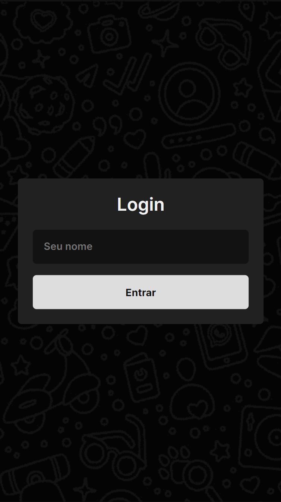

# Chat em Tempo Real

Projeto de chat em tempo real desenvolvido durante uma vídeo aula do canal Manual do Dev no YouTube.

## Tecnologias Utilizadas

- Node.js
- JavaScript
- HTML
- CSS

## Deploy

O projeto está hospedado e pode ser acessado em [https://nodejs-chat-frontend.onrender.com](https://nodejs-chat-frontend.onrender.com).
